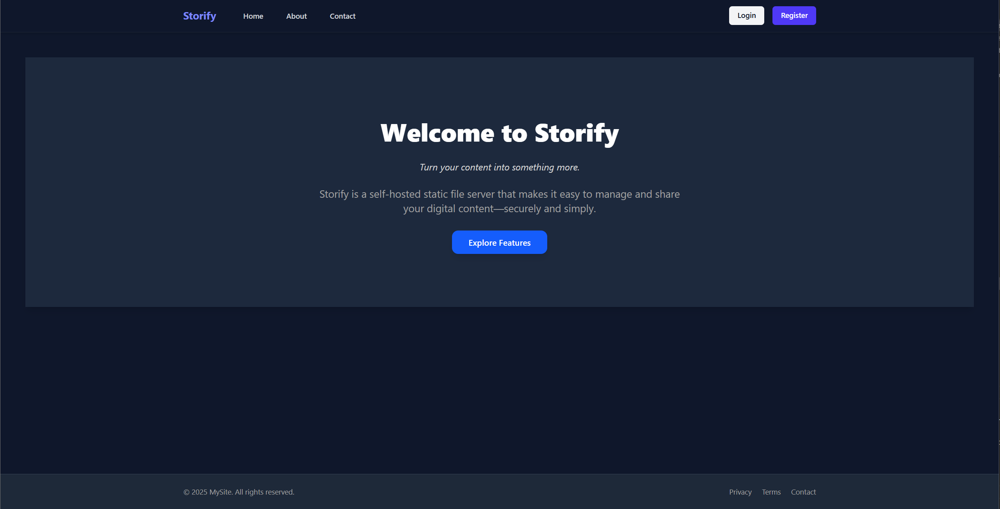
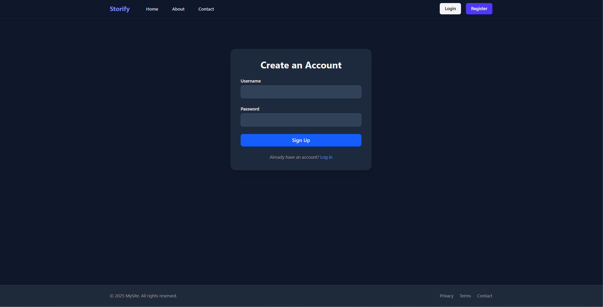
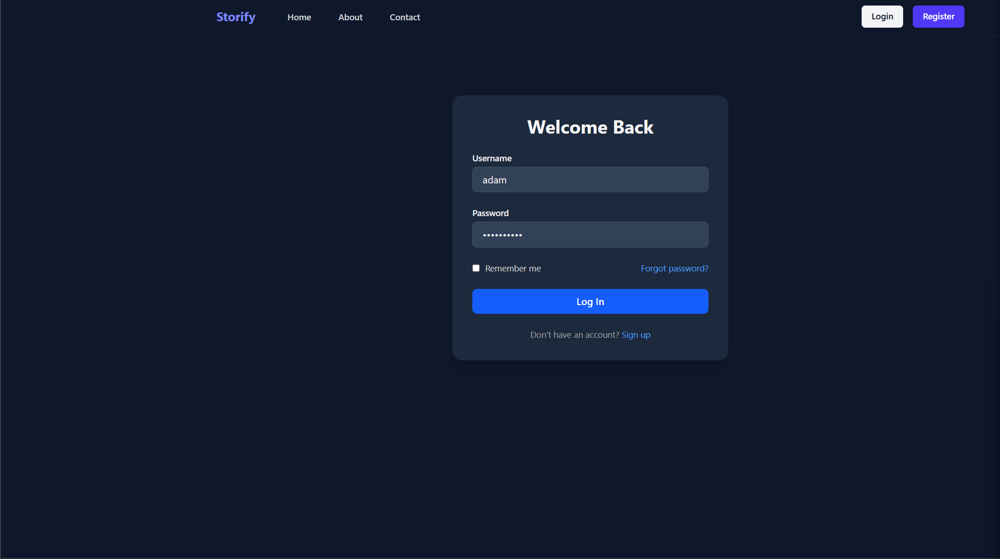
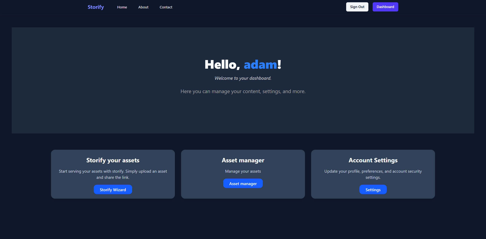
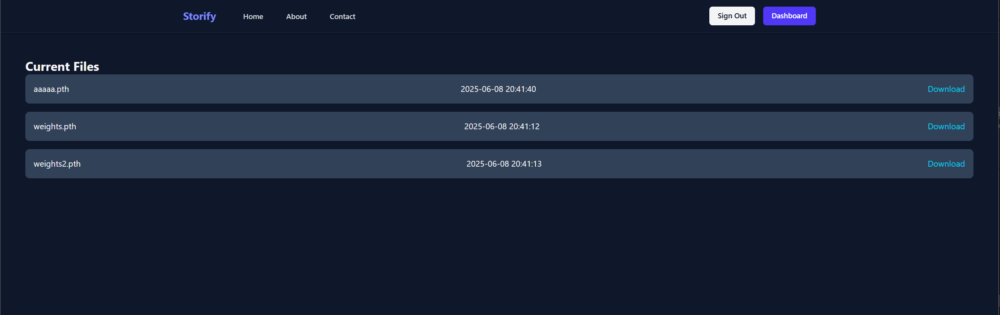

# Storify

[](https://github.com/Arian-Ott/storify/actions/workflows/python-ci.yml)
## About

**Storify** is a file storage server built with **FastAPI**, allowing users to upload and share files over the web. It ensures efficient storage by avoiding duplication—each file is stored only once. When a user uploads a file, Storify calculates its hash and checks for existing matches. If a match is found, a symbolic link (symlink) is created for the user instead of storing a duplicate.

## Features

* Fast and straightforward hosting of static files
* User authentication for managing stored files
* Protected resources requiring a valid JWT to access—such as profile pictures or user-specific content

## Getting Started

### On Debian (and derivatives)

**Requirements:**

* A working Python 3 installation
* Access to a command-line interface (CLI)

**Setup:**

1. Create a virtual environment:

   ```bash
   python3 -m venv .venv
   ```
2. Activate the environment:

   ```bash
   source .venv/bin/activate
   ```
3. Install dependencies:

   ```bash
   pip install .
   ```
4. Start the API:

   ```bash
   uvicorn api.main:app
   ```

### On Windows

**Requirements:**

* A working Python 3 installation
* Access to the Command Prompt (CMD)

**Setup:**

1. Create a virtual environment:

   ```cmd
   python3 -m venv .venv
   ```
2. Activate the environment:

   ```cmd
   .venv\Scripts\activate
   ```
3. Install dependencies:

   ```cmd
   pip install .
   ```
4. Start the API:

   ```cmd
   uvicorn api.main:app
   ```

> [!IMPORTANT]
>
> **PowerShell Execution Policy:**
> If you face issues activating your virtual environment, refer to this Stack Overflow thread:
> [https://stackoverflow.com/questions/18713086/virtualenv-wont-activate-on-windows](https://stackoverflow.com/questions/18713086/virtualenv-wont-activate-on-windows)
>
> **Missing Visual C++ Build Tools:**
> Some dependencies require the Microsoft Visual C++ Build Tools. Refer to this thread if needed:
> [https://stackoverflow.com/questions/64261546/how-to-solve-error-microsoft-visual-c-14-0-or-greater-is-required-when-inst](https://stackoverflow.com/questions/64261546/how-to-solve-error-microsoft-visual-c-14-0-or-greater-is-required-when-inst)

## Debian Packaging

Once the API is stable, this application will be packaged for Debian. This will significantly simplify the installation and setup process.

## Screenshots








